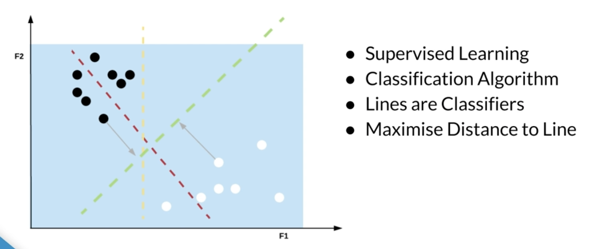
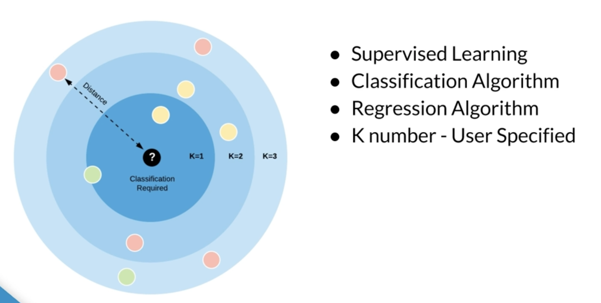
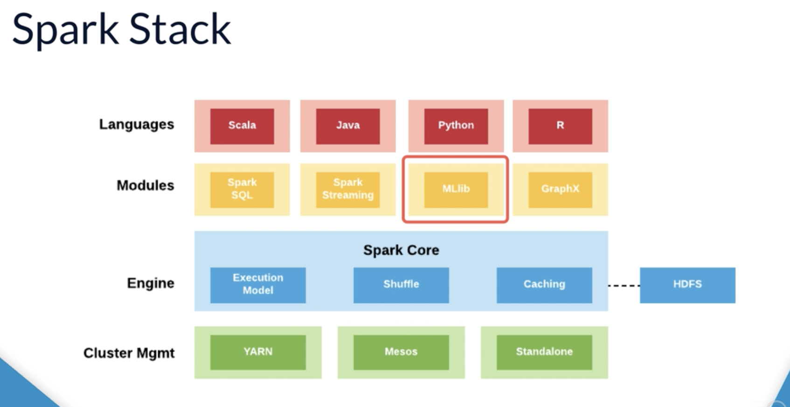
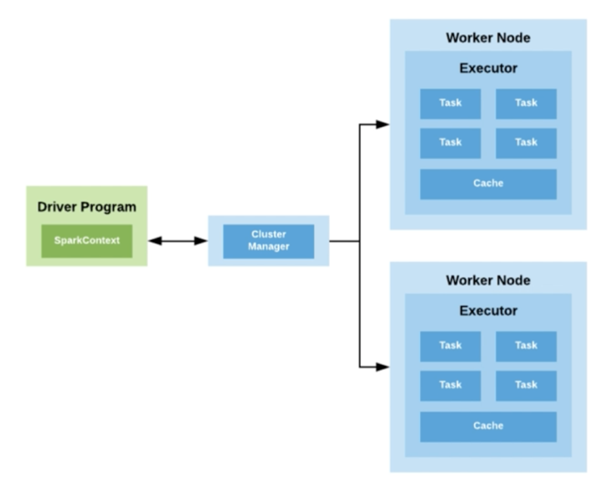
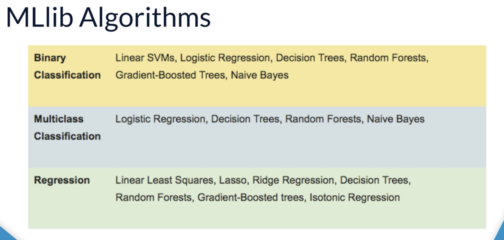
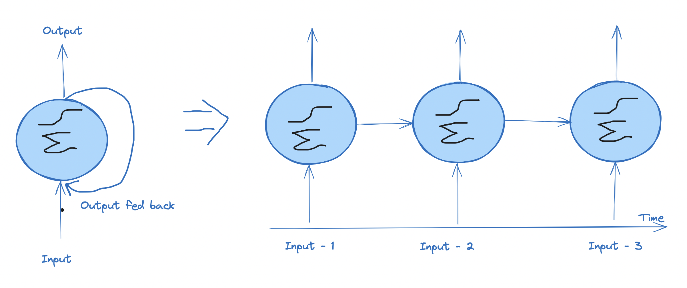

# Machine Learning on AWS

## Machine Learning Concepts
### What and where does it stand

    
<i>AI vs ML vs DL</i>
 
    

### ML Terminologies
    - Features
    - Labels
    - Instances

    
<i>Example</i>
 
    

Here ML pridication can be made as with so and so features, on what price house is likely to be sold

### Machine Learning Phases
    > Data Collection 
        > Featurization 
            > Model Training - on a subset of orig. dataset 
                > Model Testing - on a different subset of orig. dataset. Retrain to acheive accuracy.
                    > Base Model

### Types of ML 
    - Supervised Learning: Creates pridictive ML models using feauted and lebals - both.
        - Classification: When Labals can be expressed types of classes
        - Regression: When tags/labels are continuous. eg House Labels
    - Unsupervised Learning: Groups & discover patterns only on features.
        - Used for clustering & anamoly detection

### ML algorithms

    
<i>Supervised learning</i>
 
    

    
<i>Unsupervised learning</i>
 
    

### Linear Regression

    
<i>Finds best fitting line </i>
 
    

### Logistic Regression

    
<i>Uses a fn to push values towards a boundary</i>
 
    

### Dicision Trees

    
<i>Leaf node is final decision</i>
 
    

### Naive Bayes

    
<i>A collection of classification algo</i>
 
    

### SVM - Support Vector Machine

    
<i>Lines are classifiers</i>
 
    

### KNN - K Nearest Naighbours

    
<i>Applied on splits of dataset</i>
 
    

### Random Forest

    
<i>Collection of decision trees</i>
 
    

## Data & ML - An Intro

### Deep Learning real world application
- Image objects identification
- Photo caption generation
- Facebook's Deep Face: A face recognition AI
- For blinds: Audio generation from camara etc
- Real time language translation from photo
- Real tme language translation of over call/chat etc
- Smart Reply
- Automatic Ratinal Disease Assesment
- Self Driving cars
- Games

### Quick checks?
- Which keyboard shortcut in Jupyter can you use to run the current cell and then select the cell below? :- Shift + Enter
- What is the name of the popular Python distribution platform used by many data scientists? :- Anaconda
- Which of the following deep learning applications is most often associated with reinforcement learning? :- Video Game AI development
- Which python libraries provides a high-level API to run machine learning experiments using deep learning? :- Keras

## Machine Learning

### Week and Strong AI
- Week AI: Highly specilized in solving specific probelm
- Strong AI: Solves general problem

### ML Notions 
- y
    - Historical targets
    - The label
    - Ex - Daily sale of the shop when 20% discount is was given
- x
    - A Single feature
    - Ex - Location of the shop
- X
    - Multiple features
    - Ex - % discounts on product, # of hours hours open etc
- D 
    - Training Dataset
    - Represented as: All the features we have/know and historrical observations
    - I.e. D = (X, y)
- ŷ
    - y-hat
    - a guess of y
- f
    - The relationship b/w all the x we have and the historical data we have
    - I.e. ŷ = f(x)

> [ RECAP ]   
**Superwised Learning:** When lebel or y or historical outcomes is given. 
**Unsuperwised Learning**: When lebel or y or historical outcomes is not given.

### Supervised Learning problems
- Regression 
    - y ∈ set of real numbers
    - Ex: Age, Rating, temperature
- Classification
    - y ∈ {0, 1}
    - Ex: Old or young, good or bad, Summer or winter

## Distributed Machine Learning
- Motive
    - Large Dataset
    - Speed
    - Complexity
    - Accuracy
- Apache Spark
    - A lightning fast, cluster computing used to provide capability of distributed computing
    - Built on Scala
    -  

            
Spark stack

            
        

    - 

            
Spark master-slave architecture

            
        

    - Abstractions: RDD (2011) > Dataframe (2013) >  Dataset (2015)
    
- Apache Spark MLib
    - Spark's scalable ML library
    - 

            
MLib Agorithms

            
        

- Decision Trees
    - A ML model, in form of tree structure
    - Types
        - Classification Tree
            - Person in rich, Will it rain tomorrow etc
        - Regression Tree
            - Someone's income, Stock Price etc

## AWS ML Services [TODO]
### S3
- Backbone of AWS ML services, like SageMaker
- Used of creating Data Lake
- 5 TB is max support
- 11 nines durability, 99.999999999%
- 

## Deep Learning

### Types of Neural Network
- Feedforward Neural Network
    - A stack of neural network, where input is fed into bottom and prediction is generated.
- Convolutional Neural Network (CNN)
    - Used in inage classification
    - Ex, Is there a question mark in image?
- Recurrent Neural Network (RNN)
    - Deals with sequences
    - Ex, Predict stock price, translation etc
    - LTSM and GRU are difrent flavours of RNN

### CNN
#### What are they used for?
- When data is not neatly align with columns
    - Language Translation
    - Sentence Classification, question or request
    - Sentiment Analysis
- CNN can be used for finding a feature when its not aon a specific sopt
    - A 'STOP' sign in a picture
    - A word in a sentence

#### How does CNN work?
- Convolution is way of saying - I am going to breakup data in to little chunks and process those chunks individdually.
- CNN working is inspired by biology of how human identify things.
- How does CNN identify a 'STOP' sign?
    - Input image is chunked out and passed on to a group of neural network 'to identify lines'.
    - Passed on on another neural network, to idenify alignments of those lines
    - Then, to find out colors
    - So on, and at the end combined up to get
        - There is octagonal shape
        - Having more red in it
        - Written letter 'S' 'T' 'O' 'P' in it in same sequence.
    - Here is the result!

#### CNN with TensorFlow/Keras
- Source Data: Wedth  x Height X Color channels 
- Conv2D layer: Does actual convolutining on a 2D data.
    - Conv1D and conv3D is also availale - Need not to be image
- MaxPooling2D: Can be used for reducing a 2D layer down. To help performance capability
- Flatten Layer: 2D to 1D

> [Typical Usages]   
 Conv2D > MaxPooling2D > Flatten > Dense > Dropout > SoftMax

 #### Specilized CNN Architecture
 - Define specific arrangements of layers, padding, hyperparameters
 - LeNet-5: Good for handwriting recognition
 - AlexNet: Image Classification, deeper and compute intense than LeNet-5
 - GoogLeNet: Even Deepar, but better performance. Introduced  'Inception Module' (Group of convolutional Layers)
 - ResNet (Residual Network): Even deepar, maintains 'skip connections' 

 ### RNN

 #### What are they used for?
 - Time series data. 
    - Pridict future based on past data
    - Web Log, Sensor Log, Stock Trade
 - Data that consist of sequence of arbitrary length
    - Machine Translation
    - Image Caption
    - Machine Generated Music

#### How does RNN work?  

    
<i>expand...</i>
 
    

    
<i>Horizontal Scaling</i>
 
    

#### RNN Topologies
- Sequence to Sequence
    - Predict stock price based on historical data
- Sequence to Vector
    - Words in sentance to sentiment
- Vector to Sequence
    - generate caption from image
- Encoder Decoder
    - Sequnce -> Vector -> Sequence
    - Eg, Machine Translation
